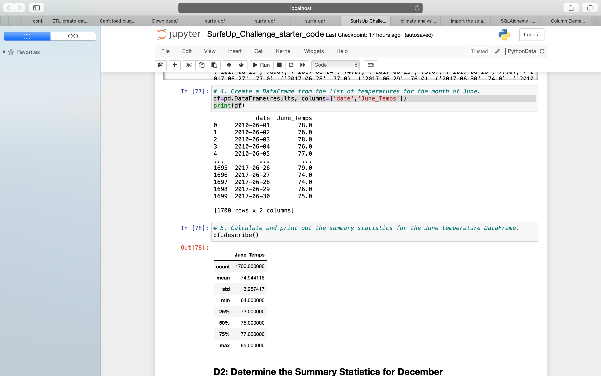
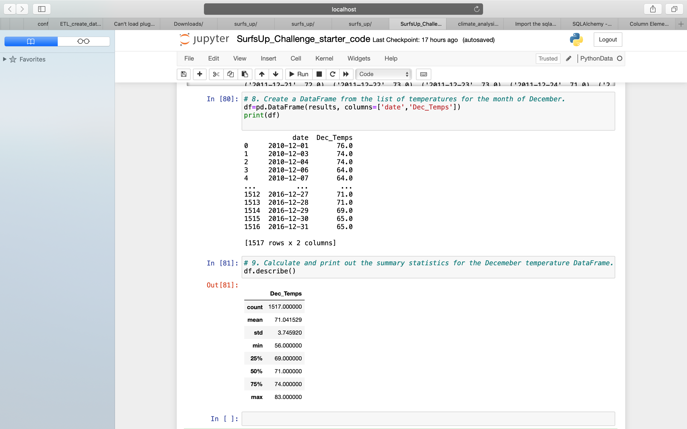

# Overview of the Weather Analysis:
The purpose of this analysis is to understand the temperature trends before opening a surf shop. Temperature data for the months of June and December in Oahu is analysed, in order to determine if the surf and ice cream shop business is sustainable year-round.

## Results:
* **Count of the temperature collected in different stations**: 

We have more count of temperatures recorded in June with a value of 1700 . So it has more data than december to analyse the information

* **Minimum temperature**:

The mimimum temperature in december have gone to 56c which is little where as the mimimum temperature in June is 64c

* **Average weather in June and December**:

But the analysis shows that the average is almost the same in both the month with a light difference

**Screenshot of June weather Summary**

**Summary of December weather Summary**

 
## Summary:

The waeter reports of June and December helps us to understand that the weather is almost the same the whole year with a slight chill time in December but can be overlooked to start a surf and iceceram shop business and make it sustainable year-round

* We can find the reliable data by determing the most active temperature recording station:

**session.query(Measurement.station, func.count(Measurement.station)).\
group_by(Measurement.station).order_by(func.count(Measurement.station).desc()).all()**

* We can find the precepitation levels and temperature in June and December so that the business is sustainable all year round:

**results = session.query(Measurement.date, Measurement.prcp,Measurement.tobs).filter(extract('month', Measurement.date) == 6).all()**
**results = session.query(Measurement.date, Measurement.prcp,,Measurement.tobs).filter(extract('month', Measurement.date) == 12).all()**
